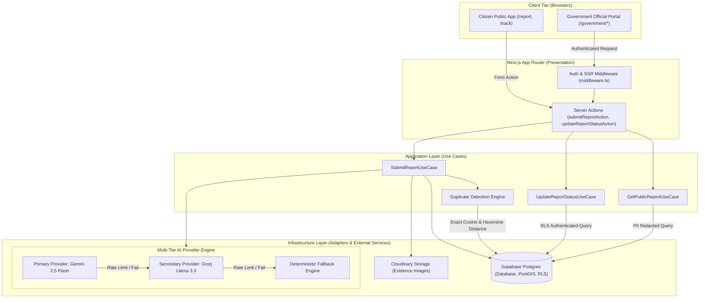
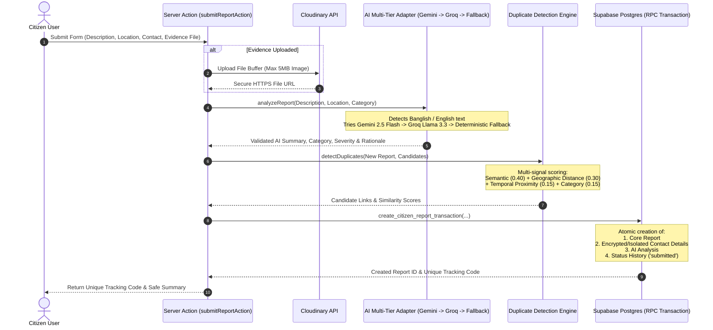

# Civic Infrastructure AI Platform - System Architecture

> [!NOTE]
> This document details the architectural boundaries, system component flows, design patterns, and reliability mechanisms of the Civic Infrastructure AI Platform.

---

## 1. Architectural Style & Layer Boundaries

The platform uses a **Modular Monolith** pattern built on Next.js 16 App Router. It strictly enforces **Clean Architecture** principles and **SOLID** software design to separate user interface, application workflows, domain logic, and external infrastructure integrations.

```
       +-------------------------------------------------------------+
       |                     PRESENTATION LAYER                      |
       |  React 19 Server & Client Components | Forms | UI Controls  |
       |         Server Actions  |  App Router Route Handlers         |
       +------------------------------+------------------------------+
                                      |
                                      v
       +-------------------------------------------------------------+
       |                      APPLICATION LAYER                      |
       |   SubmitReportUseCase        | GetPublicReportUseCase       |
       |   UpdateReportStatusUseCase  | DetectDuplicatesUseCase      |
       +------------------------------+------------------------------+
                                      |
                                      v
       +-------------------------------------------------------------+
       |                        DOMAIN LAYER                         |
       |   Report Entity              | Severity Scorer              |
       |   Category Policies          | Duplicate Math Engine        |
       +-------------------------------------------------------------+
                                      ^
                                      | implements ports
       +------------------------------+------------------------------+
       |                     INFRASTRUCTURE LAYER                    |
       |   Supabase Postgres (RLS)    | Gemini / Groq AI Adapter     |
       |   Cloudinary Evidence Storage| Haversine Geocoding Engine   |
       +-------------------------------------------------------------+
```

### Layer Rules & Responsibilities

1. **Presentation Layer (`src/app/`, `src/features/*/presentation/`)**:
   - Manages rendering, route parameters, form submissions, and user interactions.
   - Invokes application use cases via Server Actions (`actions.ts`, `managementActions.ts`).
   - *Constraint*: No direct SQL/Supabase database queries or business rules in React components.

2. **Application Layer (`src/features/*/application/`)**:
   - Defines use cases that orchestrate domain logic and external infrastructure ports.
   - Enforces transaction boundaries and handles failovers.
   - *Constraint*: No direct references to Next.js UI elements or specific AI SDKs.

3. **Domain Layer (`src/features/*/domain/`)**:
   - Contains core entities (`Report`, `DuplicateLink`, `StatusHistory`), enums, and pure calculation engines (e.g. Haversine geographic distance, similarity score math).
   - Independent of frameworks, databases, or third-party APIs.

4. **Infrastructure Layer (`src/features/*/infrastructure/`, `src/shared/infrastructure/`)**:
   - Implements domain ports for database access (`SupabaseReportRepository`), AI providers (`GeminiReportAnalysisAdapter`, `GroqReportAnalysisProvider`), and media storage (`CloudinaryService`).

---

## 2. High-Level Architecture Diagram



---

## 3. End-to-End Submission Sequence Flow

The following diagram illustrates the complete execution flow when a citizen submits an infrastructure report (in English or Banglish), including evidence upload, AI classification, failover handling, duplicate detection, and atomic transaction storage.



---

## 4. Multi-Tier AI Provider Resilience

To guarantee 99.9% uptime during emergency traffic spikes, the system employs an automated multi-provider failover strategy:

```
[ Citizen Report ] ──> [ Gemini 2.5 Flash ] ──(Success)──> [ Return AI Analysis ]
                              │
                        (Error / Rate Limit / Timeout)
                              ▼
                       [ Groq Llama 3.3 ]    ──(Success)──> [ Return AI Analysis ]
                              │
                        (Error / Rate Limit / Timeout)
                              ▼
                  [ Deterministic Fallback ] ──(Always)───> [ Flag: needs_manual_review ]
```

- **Primary Provider**: Google Gemini 2.5 Flash (Fast, high context, handles Banglish NLP).
- **Secondary Provider**: Groq Llama 3.3 70B Versatile (Low latency fallback).
- **Deterministic Engine**: Regex & Rule-Based keyword classifier ensuring report creation never fails due to external API outages.

---

## 5. Security & Privacy Model

- **Row Level Security (RLS)**: Enforces access control at the database level. Anonymous users can only read non-PII fields.
- **PII Isolation**: Citizen contact details (`name`, `email`, `phone`) are stored in `report_contacts` table, completely hidden from public tracking API calls and non-authenticated viewers.
- **Government SSR Auth**: Authentication via Supabase Auth SSR cookies, protected by middleware route guards (`/government/*`).
