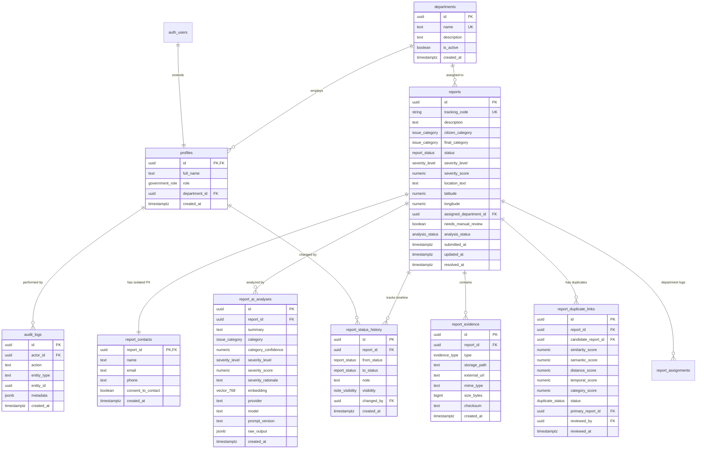

# Civic Infrastructure AI Platform - Database Schema & Security Specification

> [!NOTE]
> This document details the relational database schema, custom ENUM types, PostGIS/vector indexes, stored procedure transactions, and Row Level Security (RLS) policies implemented in Supabase Postgres.

---

## 1. Entity-Relationship Diagram (ERD)



---

## 2. Custom Enumeration Types

| Enum Name | Allowed Values |
| :--- | :--- |
| `government_role` | `'admin'`, `'dispatcher'`, `'department_officer'`, `'viewer'` |
| `issue_category` | `'pothole'`, `'broken_streetlight'`, `'water_leak'`, `'illegal_dumping'`, `'other'` |
| `severity_level` | `'low'`, `'medium'`, `'high'`, `'critical'` |
| `report_status` | `'submitted'`, `'under_review'`, `'assigned'`, `'in_progress'`, `'resolved'`, `'rejected'` |
| `analysis_status` | `'pending'`, `'completed'`, `'fallback'`, `'failed'` |
| `note_visibility` | `'public'`, `'internal'` |
| `duplicate_status` | `'suggested'`, `'confirmed'`, `'rejected'` |
| `evidence_type` | `'image'`, `'url'` |

---

## 3. Database Indexes

```sql
-- High Entropy Tracking Code Lookup
CREATE UNIQUE INDEX idx_reports_tracking_code ON reports(tracking_code);

-- Search & Filter Indexes
CREATE INDEX idx_reports_status ON reports(status);
CREATE INDEX idx_reports_severity ON reports(severity_level);
CREATE INDEX idx_reports_category ON reports(final_category);
CREATE INDEX idx_reports_dept ON reports(assigned_department_id);
CREATE INDEX idx_reports_submitted_at ON reports(submitted_at DESC);

-- English & Banglish Full-Text Search (GIN Index)
CREATE INDEX idx_reports_fts ON reports USING gin(to_tsvector('english', description || ' ' || location_text));

-- Vector Cosine Similarity Search (HNSW Index for 768-dim Embeddings)
CREATE INDEX idx_ai_analyses_embedding ON report_ai_analyses USING hnsw (embedding vector_cosine_ops);
```

---

## 4. Stored Procedures & Functions

### 4.1 Geographic Haversine Distance Calculation
```sql
CREATE OR REPLACE FUNCTION calculate_haversine_distance(
  lat1 NUMERIC, lon1 NUMERIC,
  lat2 NUMERIC, lon2 NUMERIC
) RETURNS NUMERIC AS $$
-- Calculates distance in meters between two lat/lon coordinates
```

### 4.2 Atomic Report Creation Transaction (`create_citizen_report_transaction`)
Executes an atomic database transaction that commits the core report, isolated contact details, initial AI analysis, and initial status timeline record in a single database operation, preventing orphan records.

---

## 5. Security & Row Level Security (RLS) Policies

Database security is enforced via strict Supabase Postgres RLS policies:

### 5.1 `reports` Table Policies
- **Public Select**: Anyone (`anon`, `authenticated`) can SELECT non-sensitive report fields.
- **Government Full Access**: Authenticated users with valid `profiles` can SELECT, UPDATE, and DELETE.
- **Insert Policy**: Anyone can insert via the RPC transaction function (`SECURITY DEFINER`).

### 5.2 `report_contacts` Table (PII Protection)
- **Public Select**: **DISABLED** (0 rows returned to unauthenticated calls).
- **Government Select/Update**: Only authenticated government officers can access contact info.

### 5.3 `report_status_history` Table
- **Public Select**: Allowed ONLY where `visibility = 'public'`. Internal notes are hidden from citizens.
