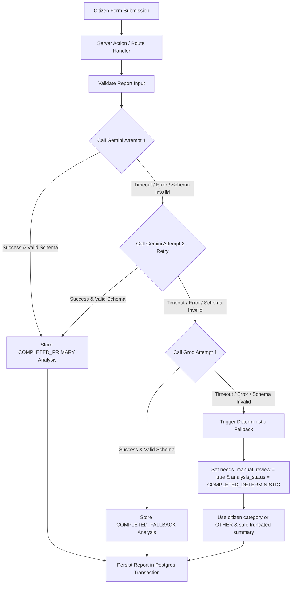

# Civic Infrastructure AI Platform — Master Implementation Plan

## 1. Executive Summary & Architectural Overview

The Civic Infrastructure AI Platform is built as a **modular monolith** inside a single Next.js App Router repository. It transforms unstructured citizen infrastructure reports (potholes, water leaks, broken streetlights, illegal dumping) into structured, actionable cases, performs automated AI analysis, flags candidate duplicate submissions using multi-signal vector scoring, and enables government officials to manage issue resolution while citizens track public progress without privacy risk.

### Core Technology Stack
- **Framework**: Next.js (App Router, Server Components by default, Server Actions for mutations, Route Handlers for external REST APIs).
- **Language**: TypeScript (Strict Mode).
- **Styling**: Modern CSS / Tailwind CSS with curated color palettes, responsive layouts, and accessible micro-interactions.
- **Database & Backend Services**: Supabase PostgreSQL, Supabase Auth SSR, Supabase Storage (private evidence buckets), Supabase Realtime, `pgvector` for semantic embeddings, and PostGIS / Haversine distance functions.
- **AI Infrastructure**: Replaceable `ReportAnalysisProvider` adapter supporting Google Gemini or OpenAI with structured JSON schemas, timeouts, retries, and deterministic fallbacks.
- **Geocoding & Location**: Replaceable `GeocodingProvider` adapter (Nominatim / Mapbox).

---

## 2. Clean Architecture Layer & Folder Structure

```text
src/
├── app/                            # Presentation Layer (Next.js App Router Routes & Pages)
│   ├── (public)/                   # Citizen-facing routes (No Auth required)
│   │   ├── report/new/page.tsx     # Citizen report submission form
│   │   ├── report/success/[trackingCode]/page.tsx  # Submission confirmation
│   │   ├── track/page.tsx          # Public tracking search
│   │   └── track/[trackingCode]/page.tsx # Public report timeline & status
│   ├── (government)/               # Protected government official routes
│   │   ├── government/login/page.tsx # Official secure login
│   │   ├── government/dashboard/page.tsx # Operational dashboard & metrics
│   │   └── government/reports/[reportId]/page.tsx # Detail & management view
│   └── api/                        # REST API Route Handlers
│       ├── reports/route.ts
│       ├── tracking/[trackingCode]/route.ts
│       └── government/...
├── features/                       # Modular Feature Boundaries
│   ├── reporting/                  # Citizen submission feature module
│   │   ├── domain/                 # Entity logic (Report, Contact, Location)
│   │   ├── application/            # SubmitReportUseCase, ValidateForm
│   │   ├── infrastructure/         # PostgresReportRepository
│   │   └── presentation/           # SubmissionForm component, Server Actions
│   ├── tracking/                   # Public tracking feature module
│   ├── government-management/      # Dashboard, Assignment, Status Transitions
│   ├── ai-analysis/                # AI Report Analysis adapter & schema validation
│   ├── duplicate-detection/        # Multi-signal duplicate scoring engine
│   └── departments/                # Department entity management
└── shared/                         # Shared Cross-Cutting Utilities
    ├── domain/                     # Result/Error types, Value Objects
    ├── application/                # Ports (ReportRepository, ReportAnalysisProvider)
    ├── infrastructure/             # Supabase clients (server, browser, service-role)
    └── presentation/               # UI Design System components, Zod schemas
```

---

## 3. Domain Entities, Use Cases, Ports & Adapters

### Key Domain Entities
- `Report`: Aggregate root representing an issue submission.
- `ReportContact`: Separate entity storing citizen contact PII.
- `ReportAIAnalysis`: Structured AI metadata, severity rating, and vector embedding.
- `ReportEvidence`: Photo asset path or external evidence URL.
- `ReportDuplicateLink`: Relationship link between candidate duplicate reports.
- `ReportStatusHistory`: Immutable timeline log entry.
- `Department`: City administrative department.
- `GovernmentProfile`: Official user role and department affiliation.

### Application Use Cases
1. `SubmitReportUseCase`: Coordinates validation, evidence pre-signing, AI analysis call, embedding generation, duplicate candidate lookup, and RPC database creation.
2. `GetPublicTrackingViewUseCase`: Fetches report data and transforms it into `PublicReportDTO` redacting contact PII and internal notes.
3. `SearchGovernmentReportsUseCase`: Executes multi-criteria search and pagination for officials.
4. `AssignReportDepartmentUseCase`: Reassigns department and appends history entry.
5. `ChangeReportStatusUseCase`: Validates status state machine transitions and appends timeline note.
6. `AddProgressNoteUseCase`: Validates visibility (`public` vs `internal`) and records note.
7. `AnalyzeReportUseCase`: Executes structured LLM analysis with retry and fallback.
8. `DetectDuplicatesUseCase`: Executes candidate filtering and calculates explainable multi-signal score.

### Primary Ports (Interfaces)
- `ReportRepository`: Interface for persisting and querying reports.
- `ReportAnalysisProvider`: Port for AI category, summary, and severity generation.
- `EmbeddingProvider`: Port for generating 768-dim text vectors.
- `GeocodingProvider`: Port for normalizing address strings into coordinates.
- `EvidenceStorage`: Port for generating private pre-signed upload URLs.

---

## 4. AI Analysis & Automatic Failover Workflow



---

## 5. Multi-Signal Duplicate Detection Scoring Formula

Duplicate detection runs on candidate reports generated within a **500m geographic radius** and **14-day time window**. The final similarity score is calculated as:

$$\text{Score} = 0.45 \times S_{\text{semantic}} + 0.30 \times S_{\text{distance}} + 0.15 \times S_{\text{temporal}} + 0.10 \times S_{\text{category}}$$

- **Semantic Similarity ($S_{\text{semantic}}$)**: Cosine similarity of text embeddings ($\text{CosineSimilarity}(v_1, v_2)$).
- **Geographic Distance Score ($S_{\text{distance}}$)**: Linear decay from 1.0 (at 0m) to 0.0 (at 500m+).
- **Temporal Proximity Score ($S_{\text{temporal}}$)**: Linear decay from 1.0 (same day) to 0.0 (14 days apart).
- **Category Compatibility ($S_{\text{category}}$)**: 1.0 for exact category match; 0.5 for related category; 0.0 otherwise.

**Decision Threshold**:
- $\text{Score} \ge 0.70$: Creates a `report_duplicate_links` entry with status `suggested`.
- **Crucial Rule**: The new report is **NEVER deleted or rejected**. Both reports remain stored and accessible.

---

## 6. Phase-by-Phase Implementation Roadmap

### Phase 1 — Repository & Environment Setup
- **Scope**: Codebase initialization, directory layout, environment configuration, linter/typecheck setup.
- **Affected Files**: `package.json`, `tsconfig.json`, `tailwind.config.ts`, `.env.example`, `src/shared/`.
- **Dependencies**: None.
- **Implementation Tasks**:
  1. Set up Next.js App Router with TypeScript strict mode.
  2. Configure Tailwind CSS design tokens and Google Inter font.
  3. Create `.env.example` template.
  4. Establish feature-first directory layout.
- **Tests**: `pnpm build` and `pnpm lint`.
- **Acceptance Criteria**: App compiles cleanly; home page renders without errors.
- **Risks**: Missing environment variable definitions.
- **Owner Assignment**: Person A (1.5h).

### Phase 2 — Supabase Schema, Migrations, Constraints & RLS
- **Scope**: Database tables, enums, indexes, RPC function, storage bucket, RLS policies, seed profiles.
- **Affected Files**: `supabase/migrations/*`, `supabase/seed.sql`, `src/shared/infrastructure/supabase/`.
- **Dependencies**: Phase 1.
- **Implementation Tasks**:
  1. Create Postgres migrations for `reports`, `report_contacts`, `report_ai_analyses`, `report_evidence`, `report_duplicate_links`, `report_status_history`, `departments`, `profiles`, `audit_logs`.
  2. Add `pgvector` index and full-text search indexes.
  3. Implement `create_citizen_report_transaction` RPC function.
  4. Write RLS policies denying `anon` access to contact PII and enforcing official roles.
  5. Seed initial departments and official accounts.
- **Tests**: SQL migration replay test + RLS security unit tests.
- **Acceptance Criteria**: Migrations apply cleanly on fresh Postgres instance; `anon` select on `report_contacts` is rejected.
- **Risks**: RLS policies locking out legitimate server queries.
- **Owner Assignment**: Person C (3.0h).

### Phase 3 — Citizen Report Submission
- **Scope**: Public submission form UI, location selection, photo upload, server action processing, report persistence.
- **Affected Files**: `src/app/(public)/report/new/page.tsx`, `src/features/reporting/`, `src/shared/presentation/components/`.
- **Dependencies**: Phase 2.
- **Implementation Tasks**:
  1. Build responsive form UI with character counter and category selection.
  2. Integrate geolocation picker and address input.
  3. Build photo upload component with file size/MIME validation.
  4. Implement `SubmitReportUseCase` calling RPC transaction.
- **Tests**: Zod form validation unit test + submission integration test.
- **Acceptance Criteria**: Valid submission generates report and returns high-entropy tracking code.
- **Risks**: Unchecked large file uploads.
- **Owner Assignment**: Person B (3.5h).

### Phase 4 — Submission Confirmation & Public Progress Tracking
- **Scope**: Success page (`/report/success/[trackingCode]`) and public tracking search/timeline (`/track/[trackingCode]`).
- **Affected Files**: `src/app/(public)/report/success/`, `src/app/(public)/track/`, `src/features/tracking/`.
- **Dependencies**: Phase 3.
- **Implementation Tasks**:
  1. Build confirmation view with 1-click copy tracking code button.
  2. Implement `GetPublicTrackingViewUseCase` returning redacted `PublicReportDTO`.
  3. Build public progress timeline component displaying public status notes.
- **Tests**: Unit test verifying `PublicReportDTO` excludes contact PII and internal notes.
- **Acceptance Criteria**: Searching tracking code renders status and timeline without leaking citizen PII.
- **Risks**: Inadvertent exposure of internal notes.
- **Owner Assignment**: Person B (2.5h).

### Phase 5 — Government Authentication & Dashboard
- **Scope**: Supabase Auth SSR official login, protected routes middleware, dashboard list, search, multi-criteria filters.
- **Affected Files**: `src/app/(government)/`, `src/middleware.ts`, `src/features/government-management/`.
- **Dependencies**: Phase 2.
- **Implementation Tasks**:
  1. Implement login page (`/government/login`) using `@supabase/ssr`.
  2. Add Next.js middleware enforcing session checks on `/government/*`.
  3. Build dashboard table with search bar (tracking code, description, location) and status/severity filters.
  4. Display operational analytics summary cards.
- **Tests**: Middleware redirect test for unauthenticated access.
- **Acceptance Criteria**: Unauthenticated users cannot access dashboard; login unlocks authorized view.
- **Risks**: Session cookie misconfiguration in middleware.
- **Owner Assignment**: Person C (4.0h).

### Phase 6 — Government Detail & Report Management
- **Scope**: Detail page (`/government/reports/[reportId]`), department assignment, controlled status transitions, public/internal progress notes.
- **Affected Files**: `src/app/(government)/reports/[reportId]/page.tsx`, `src/features/government-management/`.
- **Dependencies**: Phase 5.
- **Implementation Tasks**:
  1. Build detailed management view showing citizen submission, contact PII (for dispatchers), and status timeline.
  2. Implement department assignment drawer and status transition action buttons.
  3. Add progress note form with `public` / `internal` radio toggle.
  4. Enforce immutable history logging on every mutation.
- **Tests**: State machine transition validation test + history log insertion test.
- **Acceptance Criteria**: Changing status updates status and appends timeline entry in single operation.
- **Risks**: Invalid state transitions (e.g. `resolved` -> `submitted`).
- **Owner Assignment**: Person C (3.5h).

### Phase 7 — AI Report Analysis & Automatic Provider Failover
- **Scope**: Provider-independent AI report analysis with server-side failover sequence (Gemini primary attempt 1 & retry attempt 2 -> Groq secondary attempt 1 -> Deterministic fallback), Zod schema validation, observability metadata, and prompt security.
- **Affected Files**:
  - `src/features/ai-analysis/domain/report-analysis.types.ts`
  - `src/features/ai-analysis/domain/report-analysis.schema.ts`
  - `src/features/ai-analysis/application/ports/report-analysis-provider.ts`
  - `src/features/ai-analysis/application/use-cases/analyze-report.use-case.ts`
  - `src/features/ai-analysis/infrastructure/providers/gemini-report-analysis.provider.ts`
  - `src/features/ai-analysis/infrastructure/providers/groq-report-analysis.provider.ts`
  - `src/features/ai-analysis/infrastructure/providers/fallback-report-analysis.provider.ts`
  - `src/features/ai-analysis/infrastructure/ai-provider.factory.ts`
- **Dependencies**: Phase 3.
- **Implementation Tasks**:
  1. Define provider-neutral `ReportAnalysisInput`, `ReportAnalysisResult`, and strict Zod `ReportAnalysisResultSchema` with enum bounds (`categoryConfidence` 0..1, `severityScore` 0..100).
  2. Implement `GeminiReportAnalysisProvider` with Gemini SDK / REST API, 8s `AbortController` timeout, and prompt injection guards.
  3. Implement `GroqReportAnalysisProvider` with Groq SDK / REST API, 8s timeout, and structured JSON parsing.
  4. Implement `FallbackReportAnalysisProvider` producing deterministic fallback (`needsManualReview = true`, citizen category or `OTHER`, safe summary).
  5. Implement `AiProviderFactory` / Failover Orchestrator executing bounded sequence: Gemini (2 attempts) -> Groq (1 attempt) -> Deterministic Fallback.
  6. Record observability metadata: `provider_used`, `model_used`, `fallback_triggered`, `fallback_reason`, `attempt_count`, `latency_ms`, `analysis_status`.
  7. Validate server-only environment variables (`GEMINI_API_KEY`, `GROQ_API_KEY`, `GEMINI_MODEL`, `GROQ_MODEL`, `AI_PRIMARY_PROVIDER`, `AI_FALLBACK_PROVIDER`).
- **Tests**: 14 automated unit/integration test cases covering all failover paths, timeouts, rate limits, schema errors, prompt injection, and zero key leaks using mocked provider adapters.
- **Acceptance Criteria**: Gemini primary -> Groq secondary -> Fallback flow executes seamlessly server-side without citizen interruption or credential exposure.
- **Risks**: High latency if timeouts are set too long; mitigated by strict 8-second timeout per call.
- **Owner Assignment**: `@ai` & `@architect` (3.5h).

### Phase 8 — Multi-Signal Duplicate Detection
- **Scope**: Text embedding generation, candidate prefilter query, 4-signal scoring engine, duplicate suggestion UI for officials.
- **Affected Files**: `src/features/duplicate-detection/`, `src/app/(government)/reports/[reportId]/page.tsx`.
- **Dependencies**: Phase 7.
- **Implementation Tasks**:
  1. Generate 768-dim embeddings for report text.
  2. Write SQL prefilter for candidates within 500m and 14 days.
  3. Implement scoring formula ($0.45 S_{\text{semantic}} + 0.30 S_{\text{dist}} + 0.15 S_{\text{time}} + 0.10 S_{\text{cat}}$).
  4. Display suggested duplicates on official detail page with "Confirm" / "Reject" actions.
- **Tests**: Scoring engine unit tests with true duplicate & false candidate fixtures.
- **Acceptance Criteria**: Similar reports create `suggested` links; reports are never deleted.
- **Risks**: Heavy vector calculation slowing down submission RPC.
- **Owner Assignment**: Person D (4.0h).

### Phase 9 — Realtime Dashboard Updates & Bonus Features
- **Scope**: Live dashboard updates via Supabase Realtime, interactive map view, bilingual UI elements.
- **Affected Files**: `src/features/government-management/presentation/`, `src/features/map/`.
- **Dependencies**: Phase 6 & Phase 8.
- **Implementation Tasks**:
  1. Subscribe dashboard table to Supabase Realtime `INSERT`/`UPDATE` events on `reports`.
  2. Add interactive map component displaying color-coded severity pins.
  3. Add Bangla language display support.
- **Tests**: Realtime event subscription integration test.
- **Acceptance Criteria**: New report submissions automatically pop up on active government dashboard.
- **Risks**: Realtime socket disconnects in browser.
- **Owner Assignment**: Person B & C (2.5h).

### Phase 10 — Testing, Security Review & Quality Gate
- **Scope**: Unit tests, integration tests, RLS security audit, E2E Playwright golden path, production build verification.
- **Affected Files**: `tests/`, `playwright.config.ts`, `artifacts/QUALITY_GATE_REPORT.md`.
- **Dependencies**: Phase 1 through 9.
- **Implementation Tasks**:
  1. Execute unit test suite (validation, state machine, duplicate math).
  2. Execute integration test suite (RPC transaction, AI fallback, public DTO redaction).
  3. Run Playwright E2E test covering submit -> track -> gov login -> assign -> resolve scenario.
  4. Perform STRIDE security review and secrets scan.
- **Tests**: Full test runner `pnpm test` and `pnpm test:e2e`.
- **Acceptance Criteria**: 100% test pass rate; zero critical security/privacy findings; clean production build.
- **Risks**: Flaky E2E browser tests.
- **Owner Assignment**: Person D & A (2.5h).

### Phase 11 — Demo Hardening & Release Gate
- **Scope**: Deterministic demo dataset seeding, demo runbook execution, final release tagging.
- **Affected Files**: `supabase/seed_demo.sql`, `artifacts/DEMO_RUNBOOK.md`, `README.md`.
- **Dependencies**: Phase 10.
- **Implementation Tasks**:
  1. Seed deterministic demo reports (severe hospital water leak, main road pothole, duplicate pair).
  2. Verify credentials and live environment endpoints.
  3. Record 5-minute timed demo runbook and QA guide.
- **Tests**: Manual dry-run execution of 5-minute demo script.
- **Acceptance Criteria**: End-to-end scenario executes smoothly within 5 minutes without database manual edits.
- **Risks**: Unstable external AI provider during live judging demo.
- **Owner Assignment**: Person A & D (1.5h).
